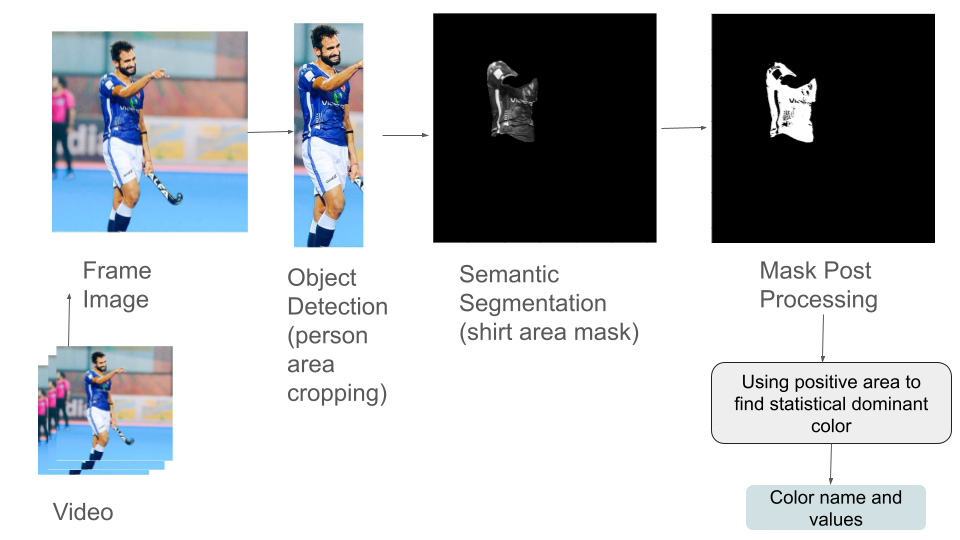
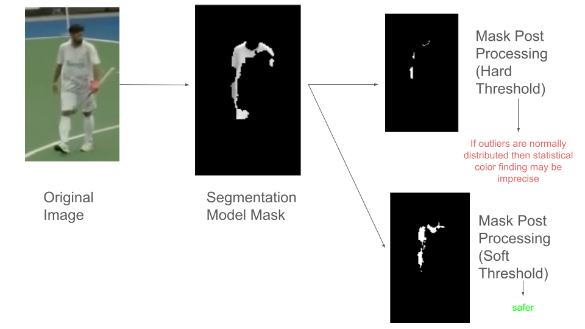
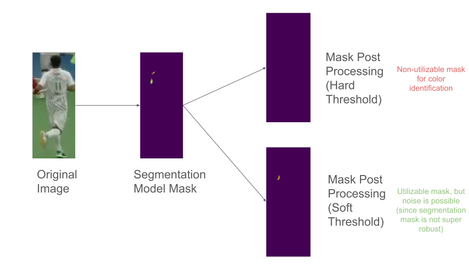
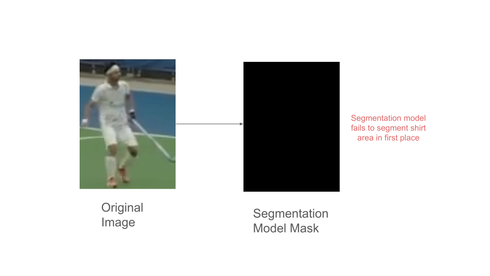
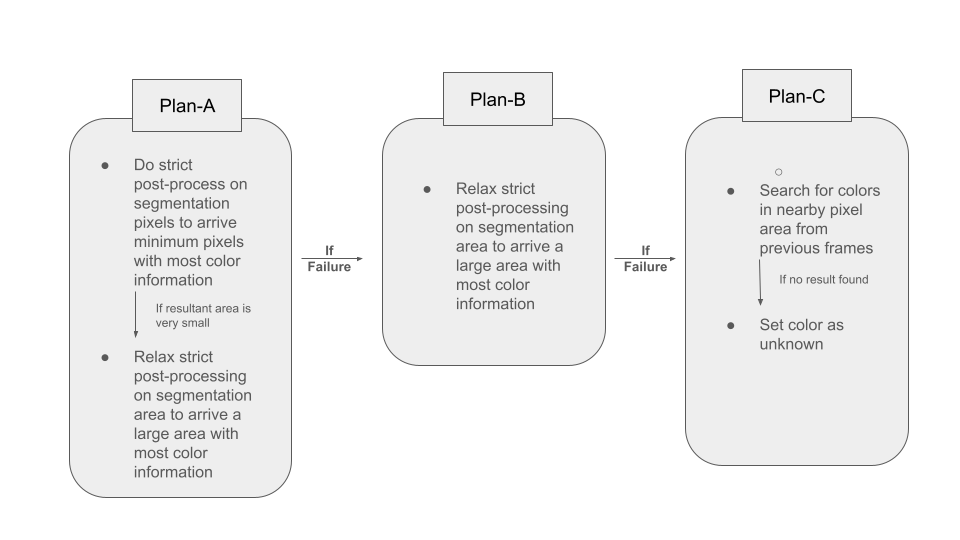

# Synopsis
For a given video of hockey player (other sport players), create bounding boxes of color same as that of uniform shirt player, with name of the color shown on top cornor of bounding box.

[](https://www.youtube.com/watch?v=b1zmmhKCPGk)
# Setup

## Platform
Tested with Ubuntu 22. For other OS (other than linux), manually setting up conda environment would be required, than the following .sh file process.

## Anaconda Environment Setup
```code
chmod +x env.sh

./env.sh
```


## Running Code on any video file
```code
chmod +x run.sh

./run.sh <path to vid file>


# resultant video is saved as output.mp4, and the corresponding frames are stored in folder 'output_imgs'
```

# Documentation
## Video Processing Pipeline
### Person Detection
For person detection in each video frame, I use YOLO version 11 from ultralytics, with pretrained weights from COCO dataset (ref: https://docs.ultralytics.com/models/yolo11/#performance-metrics),and the best size of model is chosen, which has correct balance between speeed and performance (in terms of mAP score). After detection of person as a bounding box, I crop the area of image within this bounding pixel for next step.

### Shirt Pixel Area Segmentation
A pretrained SegFormer from hugging face is utilized, via transformers library, to semantically segment on each cropped image to find pixels associated with shirt (ref: https://huggingface.co/mattmdjaga/segformer_b2_clothes).

### Post Processing (to get color of shirt of hockey player)
Since shirt area can comprise of designs which act as noise to finding statisticaly dominant color, the pixel area is further processed by apply Otsu binarization which works fast and simple on seperating interclass pixel areas by maximizing inter-class variance between majority and minority pixel value regions.

After getting suitable refined segmentation area, here the statistically dominant color value is determined by finding median within interquartile range of each channel, which is the color of the shirt.

This scheme is best visually shown in following figure.



## Technical Concerns

### Concern-1: 
While Otsu binarization requires a threshold, use a smaller threshold (called hard thresholding in this work) leads to restrictive mask, which suppress the correct color with statistical presence of noise pixel, leading to inaccurate color determination. On the other hand, soft thresholding leads to relatively less restriction allows better statisitcs for correct color due to relative larger mask.



### Concern-2: 
Hard thresholding cannot be relied upon, as it may not lead to any mask, leading to soft thresholding to be consistently considered.


### Concern-3:
Due to sequential nature of pipeline, if segmentation model fails, then trying a different segmentation model may not be practical.


### Conern-4:
The lighting conditions for same person may change, leading to different color inference across difference frames.

### Solution to concern-1, 2, 3 and partially 4:
While concern 4 would necessitate a tracking model, leading to increased inference cost with not the best tracking with current SOTA. A plan-A-B-C solution is devised that fully deals with concerns-1,2 and 3 and partially 4, as shown below.



## Video Processing Pipeline (Pseudocode)
### Main code
<div style="background-color: #f0f0f080; padding: 20px; border-radius: 5px; border: 1px solid #ddd;">

* Create empty <u>buffers</u> set:
  * coordinate buffer = {}
  * color value buffer = {}
  * Color name buffer = {}

* **WHILE** video has frames:
    * Read frame
    * **IF** frame is selected for processing:
        * Convert frame BGR -> RGB
        * Detect <span style="color: red">person</span> -> Get bounding boxes
        
        * **FOR** each bounding box:
            * Crop <span style="color: red">person</span> region
            * Segment <span style="color: blue">Shirt</span> from it
            
            * **TRY**: **[Plan A: Hard Post-Processing]**
                * Get color from **hard** thresholded <span style="color: blue">Shirt</span> area
                * **IF** color_coverage < 0.1:
                    * Get color from **soft** thresholded <span style="color: blue">Shirt</span> area
            
            * **EXCEPT**:
                * **TRY**: **[Plan B: Soft Post-Processing]**
                    * Get color from **soft** thresholded <span style="color: blue">Shirt</span> area
                * **EXCEPT**:
                    * **TRY**:
                        * Get color without post-processing
                    * **EXCEPT**: **[Plan C - Buffer Search]**
                        * Set color = "unknown"
                        * **IF** buffer not empty:
                            * threshold = 0.75 * min(box_width, box_height)
                            * Find closest match in buffer
                            * **IF** closest_distance ≤ threshold:
                                * Use buffer's color
                            * **ELSE**:
                                * Keep as "unknown"
            
            * Store current detection:
                * Add coordinates to frame coordinates
                * Add color to frame color values
                * Add name to frame color names
            
            * Draw results on frame:
                * Draw bounding box
                * Add color label
        
        * Update <u>buffer</u>:
            * Add current frame data
            * **IF** buffer.size > 5:
                * Remove oldest frame data
        
        * Save processed frame
   </div>


### Post-Processing Pipeline for  Color Detection on Segmented <span style="color: blue">Shirt</span> Pixels
<div style="background-color: #f0f0f080; padding: 20px; border-radius: 5px; border: 1px solid #ddd;">


#### Phase 1: Mask Processing
* **Input**:
    * greyscale_masked: Initial masked image
    * shirt_unit_function: Binary <span style="color: blue">shirt</span> segmentation mask
    * thr_level: Threshold type (<u>'hard'</u> or <u>'soft'</u>)

* **Process**:
    * **IF** thr_level is <u>'hard'</u>:
        * Set threshold = 0.53 × 255
        * Apply binary inverse threshold
    * **ELSE IF** thr_level is <u>'soft'</u>:
        * Set threshold = 0.75 × 255
        * Apply binary inverse threshold
    * **ELSE**:
        * Raise error for invalid threshold

    * Convert to 8-bit unsigned integer
    * Invert the thresholded image

    * **FOR** pixels where shirt_mask > 0:
        * Invert these pixels in thresholded image

#### Phase 2: Color Extraction (For more detail and references, refer to code)
* **Input**:
    * img_array: Original RGB image
    * mask: Processed binary mask
* **Process**:
    * **Statistical Color Processing**:
        * Extract pixels where mask > 0
    * **Calculate statistics (interquartile range)**:
        * Q1 = 25th percentile of each channel
        * Q3 = 75th percentile of each channel
        * IQR = Q3 - Q1 
    
    * **Remove outliers**:
        * lower_bound = Q1 - 1.5 × IQR
        * upper_bound = Q3 + 1.5 × IQR
        * Keep pixels within bounds
    
    * **Final Color**:
        * Calculate median of cleaned pixels
        * Convert to integer RGB values

    * **Return**: 
        * Phase 1: Processed binary mask
        * Phase 2: Representative RGB color values

</div>


# Future Suggestions
* Santitize the buffer, whose color names are 'unknown' with future frame values, which will indirectly also partially deal with impersistance of colors in improved manner.
* Using super resolution or debluring models on crops would certainly have better overall color detection accuracy, at the cost of inference and resources.
* Using a tracking model like DeepSORT can better deal with persistance of colors for small frame range.
# Reference
This code is based on code from following references:

* [Ultralytics-YOLOV11](https://docs.ultralytics.com/models/yolo11/#performance-metrics)
* [Huggingface-Segformer](https://huggingface.co/mattmdjaga/segformer_b2_clothes)
* [Otsu binarization](https://pyimagesearch.com/2021/02/22/opencv-connected-component-labeling-and-analysis/)
* [Statistical Outliers](https://www.geeksforgeeks.org/interquartile-range-to-detect-outliers-in-data/)
* [Color Names](https://stackoverflow.com/questions/59546962/converting-hex-value-to-name-of-the-colour-in-python)
